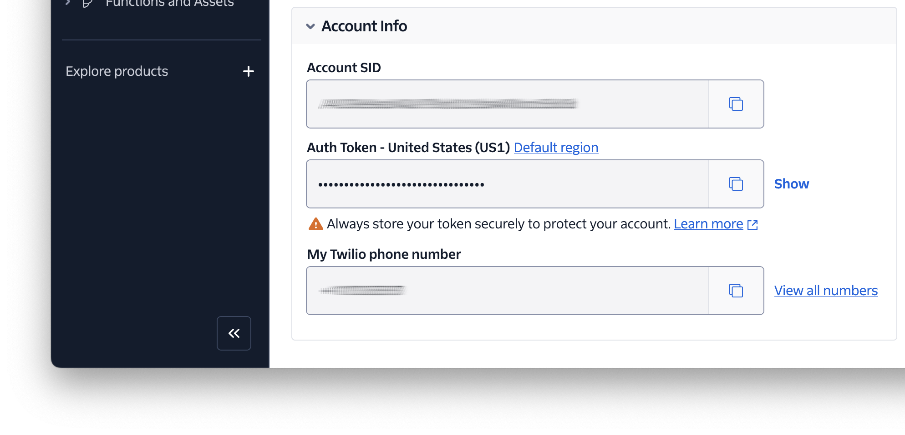

<!-- markdownlint-disable MD013 -->
# Twilio Verify Protected Image Uploader

A small application that shows how to use [Twilio Verify][twilio-verify] to allow only authenticated users to login and upload PNG and JPEG images.

## Prerequisites

To use the project, you'll need the following:

- PHP 8.3 (8.4 is preferred)
- [Composer][composer] installed globally
- A Twilio account (free or paid) with a Twilio phone number. Create one if you don't have one already.
- Your preferred web browser (I recommend [Firefox][firefox])
- A mobile phone that can receive SMS

## Getting Started

To get started with the project, you need to clone it either where you want to or wherever you keep your PHP projects.
Then, you need to change into the cloned directory, and install the project's dependencies.
To do all that, run the commands below:

```bash
git clone https://github.com/settermjd/verify-protected-image-uploader.git
cd verify-protected-image-uploader
composer install \
  --no-dev \
  --no-interaction \
  --no-suggest \
  --optimize-autoloader
```

### Configure the application

To configure the application, copy _.env.example_ as _.env_, which is where the application's environment variables are set.
Then, in _.env_, set the values of `YOUR_USERNAME` and `YOUR_PHONE_NUMBER` to your preferred email address and your mobile phone number respectively.
The email address doesn't need to be an active one, but the mobile/cell phone number does.

Next, you need to retrieve your Twilio credentials.
These are your **Account SID** and **Auth Token**, along with your **Twilio phone number**.
You can find them in the **Account Info** panel of [your Twilio Console dashboard][twilio-console].
Copy them and paste them in _.env_ in place of `TWILIO_ACCOUNT_SID`, `TWILIO_AUTH_TOKEN`, and `TWILIO_PHONE_NUMBER` respectively.



### Create a Verify Service

Following that, you need to create a Verify V2 service.


To do that, go back to [the Twilio Console][twilio-console] and navigate to **Explore products > Verify >** [Services][twilio-verify-service].
There, click **Create new**.


In the **Create new (Verify Service)** form that appears, provide a **Friendly name**, enable the **SMS** verification channel, and click **Continue**.


Following that, click **Continue** in the **Enable Fraud Guard** stage.


Now, you'll be on the Service settings page for your new Verify Service. Copy the **Service SID** and set it as the value of `VERIFY_SERVICE_SID` in _.env_.

### Start the application

With the application now set up, start [PHP's built-in web server][php-built-in-webserver] to serve it, by running the command below:

```bash
composer serve
```

The app is now available on port 8080 on your local machine, so open <http://localhost:8080/login> in your preferred web browser.
It should look like the screenshot below.


## Using the application

To use the application, on <http://localhost:8080/login>, enter the username you set for `YOUR_USERNAME` and submit the form.
You'll receive an SMS with a verification code while you're being redirected to the verification route ("/verify").
Enter the code in the form and submit it.
You should then be redirected to the upload route ("/upload").
Now that you're logged in, you can upload all the JPEG and PNG files that you want.

> [!TIP]
> If a file is not uploaded successfully, it might be larger than the maximum allowed POST size (7,340,032  bytes / 7.3 MB) or file upload size (5,242,880 bytes / 5.2 MB).
> These settings are defined in composer.json, in the "serve" script.

## Stopping the application

<!-- markdownlint-disable MD033 -->
To stop the application, in the terminal window/tab where you started the application, just press <kbd>Ctrl</kbd> + <kbd>C</kbd>.
<!-- markdownlint-enable MD033 -->

## Contributing

If you want to contribute to the project, whether you have found issues with it or just want to improve it, here's how:

- [Issues][issues]: ask questions and submit your feature requests, bug reports, etc
- [Pull requests][prs]: send your improvements

## Did You Find The Project Useful?

If the project was useful, and you want to say thank you and/or support its active development, here's how:

- Add a GitHub Star to the project
- Write an interesting article about the project wherever you blog

## Disclaimer

No warranty expressed or implied.
The software is provided as is.

<!-- Page links -->
[composer]: https://getcomposer.org
[firefox]: https://www.mozilla.org/en-US/firefox/new/
[issues]: https://github.com/settermjd/redirect-to-new-domain-middleware/issues
[php-built-in-webserver]: https://www.php.net/manual/en/features.commandline.webserver.php
[prs]: https://github.com/settermjd/redirect-to-new-domain-middleware/issues
[twilio-console]: https://console.twilio.com
[twilio-verify-service]: https://console.twilio.com/us1/develop/verify/services
[twilio-verify]: https://www.twilio.com/docs/verify
<!-- markdownlint-enable MD013 -->
